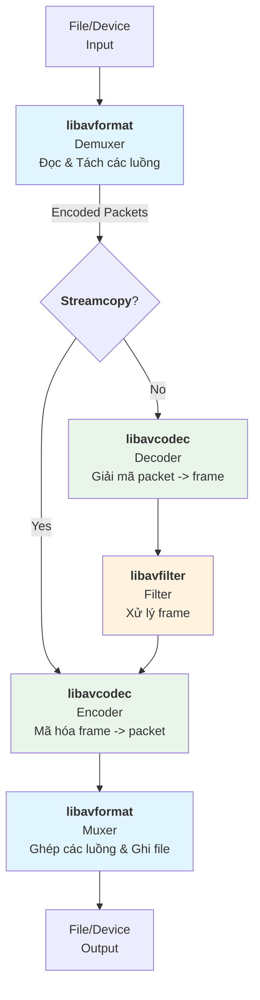

Thư viện FFmpeg hoạt động như một dây chuyền xử lý âm thanh, video. Dữ liệu thô đầu vào (MP4, AVI) sẽ được tháo rã (giải mã) thành các thành phần cơ bản (khung hình, mẫu âm thanh), sau đó có thể được chỉnh sửa (lọc) và cuối cùng lắp ráp lại (mã hóa, ghép) thành một định dạng đầu ra khác.

Dưới đây là sơ đồ chi tiết minh họa quy trình xử lý tổng quát của FFmpeg:

---

### 🧱 1. Các Thành Phần Cốt Lõi (Core Libraries)
Để hiểu chi tiết quy trình trên, trước hết cần nắm rõ vai trò của 6 thư viện chính cấu thành nên FFmpeg, còn được gọi là "Bát đại金刚" (8 vị kim cương) :

-   **libavformat** (Đóng/Mở gói): Thư viện "gác cổng". Nó chịu trách nhiệm **đọc** (giải bọc - demux) và **ghi** (đóng gói - mux) các định dạng container như MP4, MKV, AVI .
-   **libavcodec** (Mã hóa/Giải mã): "Trái tim" xử lý nặng nhất. Nó chứa các bộ giải mã và mã hóa cho hàng trăm codec như H.264, AAC, MP3 .
-   **libavfilter** (Bộ lọc): "Studio chỉnh sửa". Cung cấp vô số hiệu ứng xử lý trên dữ liệu đã giải mã như cắt, ghép, thay đổi kích thước, thêm watermark .
-   **libswscale** (Chuyển đổi Video): Chuyên xử lý các tác vụ liên quan đến hình ảnh như **thay đổi kích thước** (scale) và **chuyển đổi không gian màu** (ví dụ: YUV sang RGB) .
-   **libswresample** (Chuyển đổi Âm thanh): Tương tự libswscale nhưng dành cho âm thanh, thực hiện **chuyển đổi tần số lấy mẫu** (resample) và định dạng mẫu âm thanh .
-   **libavutil** (Tiện ích): Thư viện hỗ trợ chứa các hàm tiện ích như tính toán băm, quản lý bộ nhớ, mã lỗi..., được gọi bởi tất cả các module khác .

---

### ⚙️ 2. Quy Trình Xử Lý Chi Tiết

#### Bước 1: Đọc và Giải Bọc (Demuxing) - `libavformat`
FFmpeg sử dụng **libavformat** để mở file. Thành phần **Demuxer** sẽ đọc cấu trúc của file container, phân tách nó thành các **luồng (stream)** riêng rẽ (video, audio, subtitle) và các siêu dữ liệu (metadata) .
-   **Đầu vào:** File `input.mp4`.
-   **Đầu ra của Demuxer:** Các **AVPacket** - đây là các gói dữ liệu đã được nén (encoded), ví dụ: một khối dữ liệu H.264 hoặc một khung dữ liệu MP3 .

#### Bước 2: Giải Mã (Decoding) - `libavcodec`
**AVPacket** chưa thể sửa chữa hay phát trực tiếp được vì chúng đã bị nén. **libavcodec** sẽ nhận các gói này và giải nén (decode) chúng.
-   **Hành động:** Decoder chuyển đổi **AVPacket** (H.264) -> **AVFrame** (dữ liệu điểm ảnh thô YUV/RGB) .
-   **API hiện đại:** FFmpeg sử dụng cơ chế `send_packet` / `receive_frame`, nghĩa là bạn có thể gửi vài gói vào nhưng chỉ nhận ra vài khung hình, rất linh hoạt .

#### Bước 3: Xử Lý (Filtering) - Tùy chọn
Bạn muốn thay đổi nội dung? Đây là lúc **libavfilter** phát huy tác dụng. Nó hoạt động hoàn toàn trên các **AVFrame** chưa nén .
-   **Ví dụ:** Ghép hai video (overlay), thay đổi kích thước (scale), xoay (rotate), hoặc chèn chữ .
-   **Filtergraph:** Bạn có thể xâu chuỗi nhiều filter lại với nhau thành một "dây chuyền sản xuất" phức tạp .

#### Bước 4: Mã Hóa (Encoding) - `libavcodec`
Sau khi lọc, dữ liệu thô sẽ được gửi lại cho **libavcodec** để nén sang một định dạng mới (hoặc giữ nguyên).
-   **Hành động:** Encoder chuyển đổi **AVFrame** (YUV) -> **AVPacket** mới (ví dụ: H.265 để giảm dung lượng) .

#### Bước 5: Ghép và Ghi File (Muxing) - `libavformat`
Cuối cùng, các **AVPacket** mới từ video và audio được gửi đến **Muxer** (thuộc libavformat). Muxer có nhiệm vụ trộn (interleave) chúng và đóng gói vào một container (MP4, MKV) cùng với các thông tin header .
-   **Đầu ra:** File `output.mp4` hoàn chỉnh.

---

### 💡 3. Các Khái Niệm Quan Trọng Cần Nhớ

-   **Streamcopy (Copy dòng dữ liệu):** Một chế độ đặc biệt (sử dụng tham số `-c copy`) cho phép bỏ qua bước **Giải mã** và **Mã hóa**. FFmpeg chỉ thực hiện việc thay đổi container (ví dụ: đổi từ MKV sang MP4) mà không ảnh hưởng đến chất lượng. Lệnh này cực kỳ nhanh .
-   **Hai "Ông lớn" dữ liệu:**
    -   **AVPacket:** Đại diện cho dữ liệu **đã nén** (trước khi decode hoặc sau khi encode).
    -   **AVFrame:** Đại diện cho dữ liệu **chưa nén** (sau khi decode hoặc trước khi encode) .
-   **Context (Bối cảnh):** Các cấu trúc như `AVFormatContext`, `AVCodecContext` đóng vai trò như "ngữ cảnh" toàn cục, lưu giữ toàn bộ trạng thái và cấu hình cho toàn bộ quá trình xử lý (ví dụ: độ phân giải, codec đang dùng, bitrate) .

Hy vọng sự phân tích có cấu trúc này giúp bạn hình dung rõ hơn về cách FFmpeg vận hành. Nếu có điểm nào cần đi sâu hơn, hãy cho tôi biết nhé.

